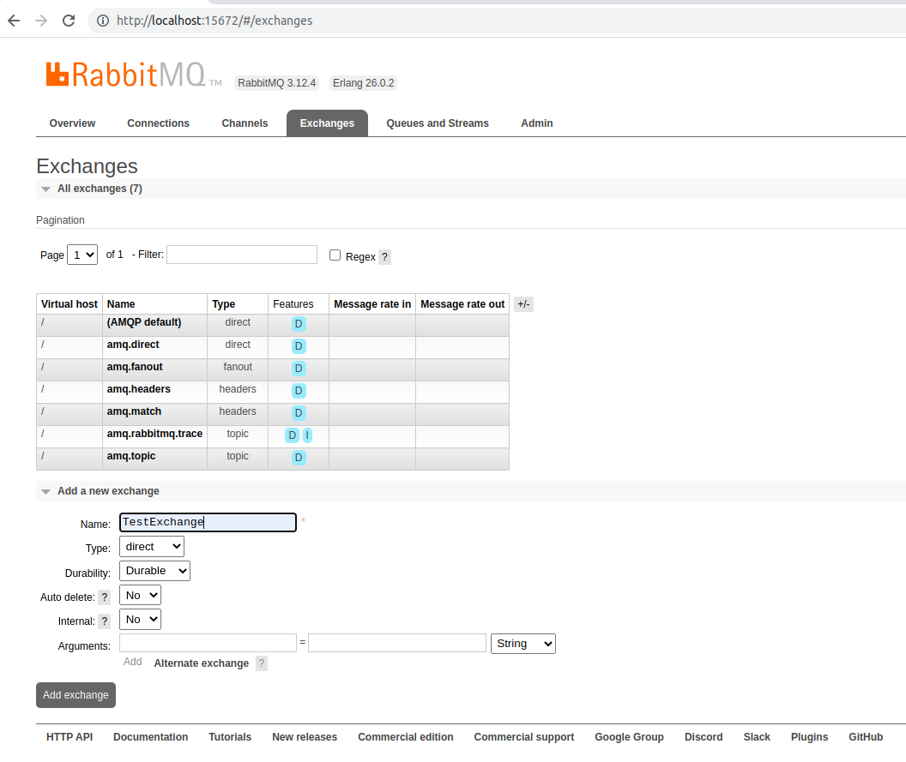
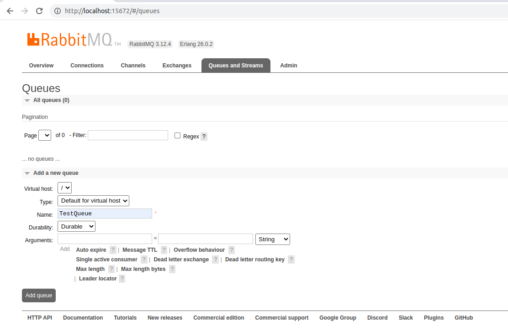
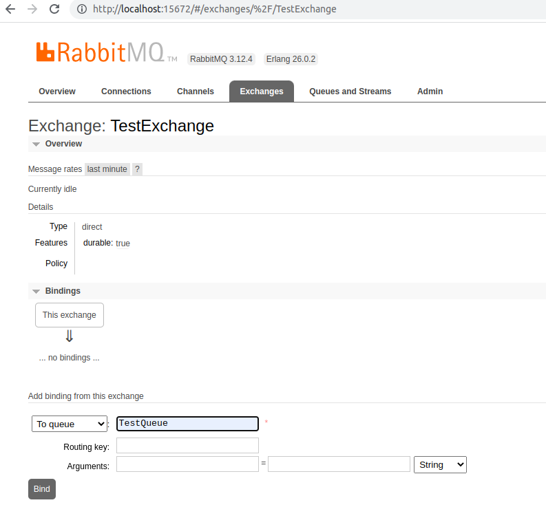
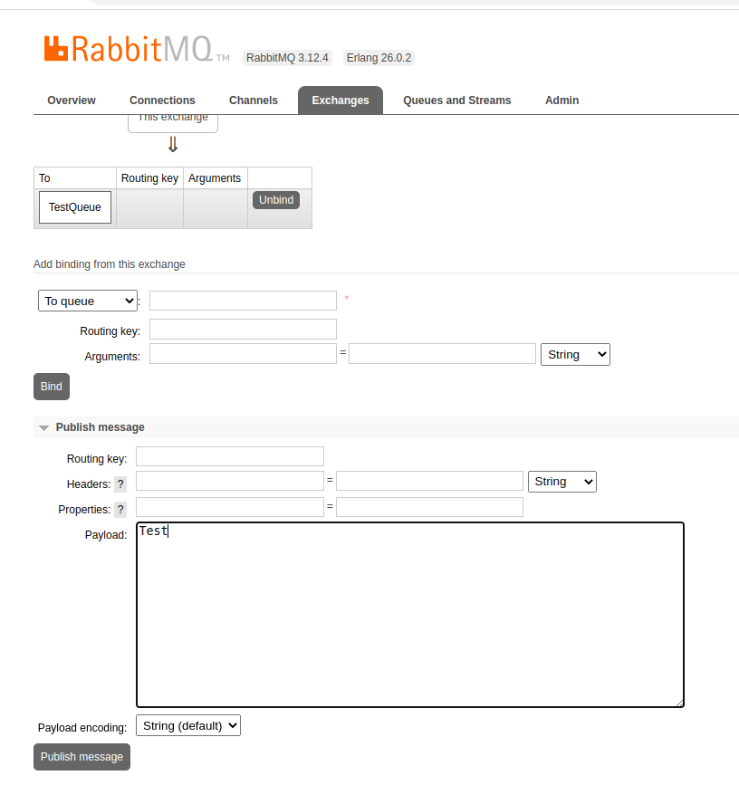
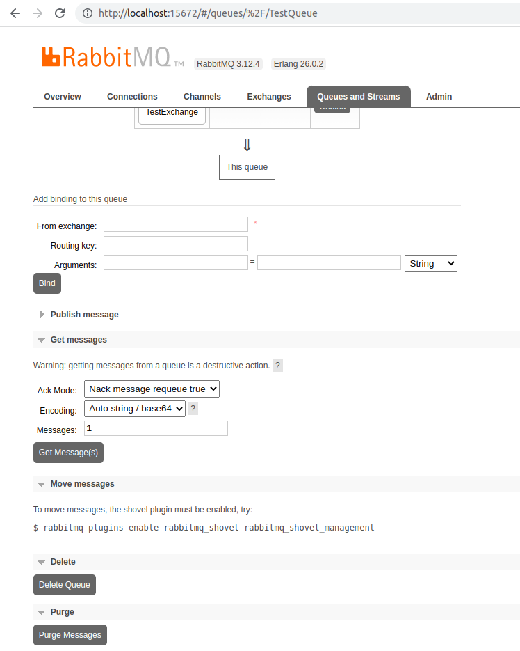

### Why KEDA?

- To automatically scale your Kubernetes workloads based on external event metrics. It is a Kubernetes-based Event Driven Autoscaler.


### Example Use Cases
1. KEDA can be leveraged to dynamically scale image processing pods based on messages in an Apache Kafka topic or RabbitMQ queue or AWS SQS queue.
2. KEDA can be leveraged to dynamically scale data processing pods based on Prometheus metrics indicating memory consumption surpassing 80%.

### Precondition
- K8S Cluster

### Installation

0. Install RabbitMQ Server

```helm repo add bitnami https://charts.bitnami.com/bitnami```

```helm install rabbitmq --set auth.username=guest --set auth.password=guest bitnami/rabbitmq --wait```

To Access the RabbitMQ AMQP port:

```kubectl port-forward --namespace default svc/rabbitmq 5672:5672```

To Access the RabbitMQ Management interface:

```kubectl port-forward --namespace default svc/rabbitmq 15672:15672```

1. Install KEDA

```helm repo add kedacore https://kedacore.github.io/charts```

```helm repo update```

```helm install keda kedacore/keda --namespace keda --create-namespace```

### Test
1. Open  RabbitMQ Management Web dashboard

```http://localhost:15672/```

The user and psw are :  ```guest```

2. Create an Exchange




3. Create a Queue



4. Bind the TestQueue to TestExchange



5. Create a KEDA Scaled Object

kubectl apply -f scaled_object.yaml 

6. Create a deployment

kubectl apply -f nginx-deployment.yaml 

Note: After running this command, there will be 2 nginx pods. However, after the cooldownPeriod of 10 seconds, the number of pods will drop to 0 because the TestQueue is empty.

7. Sending message to the TestQueue from TestExchange

7.1. Write any message to Payload and press "Publish Message" like below:



As we defined in scaled_object.yaml file, every 4 messages in the TestQueue, one replica will be spawned, up to maxReplicaCount.

Initially there will be 0 nginx pod, because the TestQueue is empty:

```
kubectl get pods
NAME         READY   STATUS    RESTARTS   AGE
rabbitmq-0   1/1     Running   0          118m
```

After pressing "Publish Message" for the first time, the nginx pod will be scaled from 0 to 1. The 2nd scaling will happen after publishing the 5th message. Because every 4 messages in the TestQueue, one replica will be spawned.

After sending the first message:
```
kubectl get pods
NAME                                READY   STATUS    RESTARTS   AGE
nginx-deployment-544dc8b7c4-h98p8   1/1     Running   0          3s
rabbitmq-0                          1/1     Running   0          125m
```

After sending the 5th message:
```
kubectl get pods
NAME                                READY   STATUS    RESTARTS   AGE
nginx-deployment-544dc8b7c4-h98p8   1/1     Running   0          75s
nginx-deployment-544dc8b7c4-pzl6k   1/1     Running   0          2s
rabbitmq-0                          1/1     Running   0          126m
```


After sending the 9th message:
```
kubectl get pods
NAME                                READY   STATUS    RESTARTS   AGE
nginx-deployment-544dc8b7c4-h98p8   1/1     Running   0          4m51s
nginx-deployment-544dc8b7c4-pzl6k   1/1     Running   0          3m38s
nginx-deployment-544dc8b7c4-x76vt   1/1     Running   0          8s
rabbitmq-0                          1/1     Running   0          130m

```

Let's delete all messages from the TestQueue pressing the "Purge Messages" below: 



After deleting the messages, nginx pod will be scaled to 0, because the TestQueue is empty.
```
kubectl get pods
NAME         READY   STATUS    RESTARTS   AGE
rabbitmq-0   1/1     Running   0          136m

```


### Resources
1. https://keda.sh/
2. https://github.com/kedacore/keda
3. https://keda.sh/docs/2.11/scalers/rabbitmq-queue/
4. https://keda.sh/docs/2.11/concepts/scaling-deployments/
5. https://github.com/kedacore/sample-go-rabbitmq/blob/main/README.md